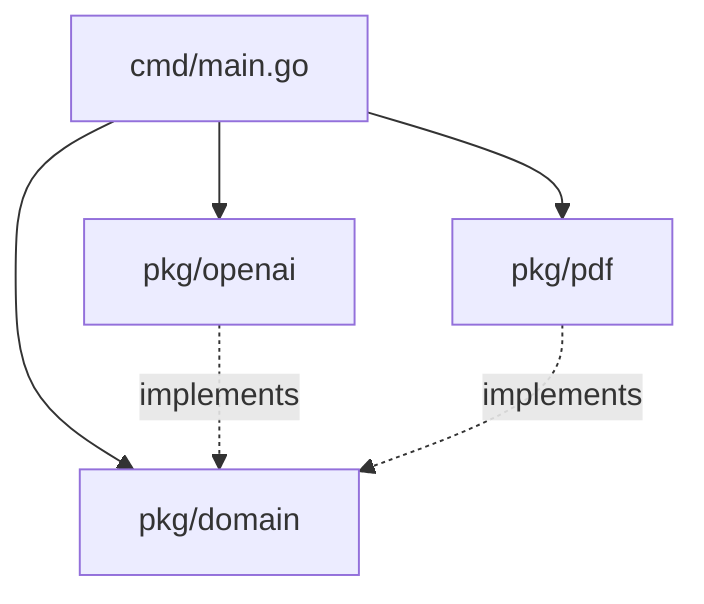

# System Design & Architecture

This document describes the architectural decisions, design patterns, and trade-offs made in the `openai-pdf-sdk`.

## 1. High-Level Architecture

The SDK follows **Clean Architecture** principles to separate concerns and ensure testability.

### Layers
1.  **Domain (`pkg/domain`)**: Defines the core interfaces (`TextExtractor`, `AIClient`) and entities. This layer has NO dependencies on external libraries.
2.  **Infrastructure (`pkg/openai`, `pkg/pdf`)**: Implements the domain interfaces.
    *   `pkg/pdf`: Wraps `ledongthuc/pdf` for PDF processing.
    *   `pkg/openai`: Wraps `sashabaranov/go-openai` and adds resilience.
3.  **Application/Presentation (`cmd`)**: The CLI tool that glues the layers together.

## 2. Key Technical Decisions

### Resilience Patterns
Since we rely on the external OpenAI API, we implemented the following patterns in `pkg/openai`:
*   **Circuit Breaker Strategy**: We use valid retries + rate limiting as a soft circuit breaker.
*   **Exponential Backoff**: Using `cenkalti/backoff/v4` to safely retry transient errors (429, 5xx).
*   **Rate Limiting**: logic with `golang.org/x/time/rate` to respect API limits client-side.

### Observability
*   **Structured Logging**: We use `log/slog` for structured, leveled logging. This allows the consumer to inject their own logger (e.g., JSON logger for production).
*   **Tracing**: We integrated `go.opentelemetry.io/otel` to instrument key operations (`UploadFile`, `SendText`). This is crucial for debugging latency in production.

### Performance & Concurrency
*   **sync.Pool**: In `pkg/pdf`, we use `sync.Pool` to reuse `bytes.Buffer` instances. PDF extraction can be memory-intensive; reusing buffers significantly reduces Garbage Collection (GC) pressure.
*   **Context Propagation**: All I/O bound methods accept `context.Context` to support cancellation and timeouts.

### Trade-offs
*   **Complexity vs. Simplicity**: We chose to wrap the OpenAI client rather than exposing it directly. **Pro**: We can enforce resilience and logging. **Con**: We must maintain the wrapper.
*   **Generality vs. Specificity**: The `TextExtractor` interface is generic. **Pro**: We can swap PDF for OCR or other text sources. **Con**: It might be too simple for complex PDF layouts (tables, images).

## 3. Future Improvements
*   **Mock Generation**: Use `mockgen` to automatically generate mocks for domain interfaces.
*   **Integration Tests**: Add more robust integration tests that spin up a local mock server for OpenAI.
